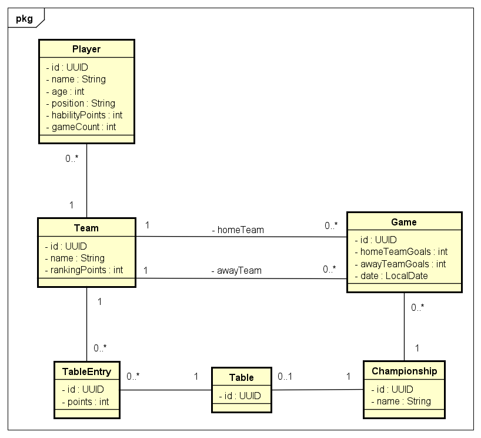

# Championship API

O projeto foi feito originalmente utilizando as ferramentas de CI/CD do Gitlab, disponível nesse link: [https://gitlab.com/devops-project-ufrn/ChampionshipAPI](https://gitlab.com/devops-project-ufrn/ChampionshipAPI)

Após configurar tudo e fazer o deploy na Google Cloud, a aplicação estará disponível no link: [http://championship-api.duckdns.org/](http://championship-api.duckdns.org/)

Configurações do Kubernetes [no README.md da pasta k8s](k8s/README.md)

## Autores

| [<br><sub>João Pedro</sub>](https://github.com/JoaoPFranca) | [<br><sub>Vinicius César</sub>](https://github.com/vinithecsar) |
| :---: | :---: |

## Sumário

- [Sobre o Projeto](#sobre-o-projeto)
- [Modelo de Dados](#modelo-de-dados)
- [Pipeline de CI/CD](#pipeline-de-cicd)
  - [1. Etapa de Build e Teste](#1-etapa-de-build-e-teste-build-and-test)
  - [2. Etapa Versionamento](#2-etapa-de-versionamento-version)
  - [3. Etapa de Empacotamento](#3-etapa-de-empacotamento-package)
  - [4. Etapa de Preparar a Infra - Terraform](#4-etapa-de-preparar-a-infra---terraform-prepare-to-deploy)
  - [5. Etapa de Deploy para o GKE - Kubernetes](#5-etapa-de-deploy-para-o-gke---kubernetes-deploy)
- [Entregas da terceira unidade](#features-entregues-3a-unidade)
- [Executando o projeto localmente](#executando-o-projeto-localmente)
  - [1. Iniciando o Banco de Dados](#1-iniciando-o-banco-de-dados-postgresql-com-docker-compose)
  - [2. Executando a aplicação](#2-executando-a-aplicação-spring-boot)
  - [Executando com Docker](#executando-com-docker)

## Sobre o projeto

A **Championship API** é um sistema de backend construído com Spring Boot para gerenciar campeonatos esportivos. A API permite a criação de campeonatos, equipes e jogadores, formando a base para qualquer competição.

As funcionalidades principais incluem:

- **Gerenciamento de Campeonatos**: Criar novos campeonatos, adicionar equipes a eles e consultar a tabela de classificação completa com a pontuação.
- **Gerenciamento de Equipes**: Criar equipes, adicionar ou remover jogadores e consultar informações detalhadas.
- **Gerenciamento de Jogadores**: Manter um registro de jogadores com seus atributos, como idade e nível de habilidade.
- **Gerenciamento de Partidas**: Agendar partidas entre duas equipes, registrar os resultados e buscar o histórico de jogos de um time específico.

## Modelo de Dados

O diagrama de classes abaixo representa as principais entidades e seus relacionamentos no sistema.



## Pipeline de CI/CD

Este projeto utiliza um pipeline de Integração e Entrega Contínua (CI/CD) para automatizar os processos de verificação, teste e empacotamento da aplicação. A configuração do pipeline está no arquivo `.gitlab-ci.yml` e visa garantir a qualidade do código, a segurança e a padronização das entregas.

O pipeline é dividido em duas etapas principais:

### 1. Etapa de Build e Teste (`build-and-test`)

Esta é a primeira barreira de qualidade do pipeline. Ela é executada em todas as alterações enviadas ao repositório (em qualquer branch).

- **Propósito**: Compilar o código-fonte, executar todos os testes automatizados e verificar se o projeto está em um estado funcional e estável.
- **Comando Executado**: `mvn clean verify`
  - Executa o ciclo de vida completo do Maven, que inclui compilação, teste e validação do pacote gerado.

### 2. Etapa de Versionamento (`version`)

Esta etapa só é executada quando as alterações são mescladas ou enviadas diretamente para a branch **`main`**.

- **Propósito**: Fazer a geração automática de tags
- **O que acontece**:
  1. **Pegamos a tag atual.**
  2. De acordo com a mensagem no commit, definimos em qual das três subdivisões da tag vamos adicionar mais um.
    - Seguimos o conventional commits.

### 3. Etapa de Empacotamento (`package`)

Esta etapa só é executada quando as alterações são mescladas ou enviadas diretamente para a branch **`main`**.

- **Propósito**: Empacotar a aplicação em uma imagem Docker e enviá-la para o registro de contêineres do GitLab (`Container Registry`), criando um artefato pronto para ser implantado em qualquer ambiente.
- **O que acontece?**:
  1.  **Autenticação Segura**: O pipeline realiza o login no `Container Registry` do GitLab utilizando variáveis de ambiente pré-definidas (`$CI_REGISTRY_USER`, `$CI_JOB_TOKEN`) no Runner do próprio Gitlab.
  2.  **Push da Imagem**: A imagem gerada é enviada (`push`) para o registro, ficando disponível para a etapa de deploy.

### 4. Etapa de Preparar a Infra - Terraform (`prepare-to-deploy`)

Esta etapa só é executada quando as alterações são mescladas ou enviadas diretamente para a branch **`main`**.

- **Propósito**: Preparar a infraestrutura usando Terraform. Essa ferramenta de IaC nos possibilita fazer um gerenciamento do estado da Infraestrutura do projeto como código, facilitando a consistência entre os ambientes.
- **O que acontece?**:
  1. **Autenticação**: Usamos a variável de CI/CD (`GCP_CREDENTIALS`) para guardar a nossa chave de acesso ao GKE, e a exportamos como variável de ambiente.
  2. **Inicializamos o Terraform**: Usamos o comando (`terraform init`) para preparar o ambiente Terraform (Baixar os providers, criar os arquivos internos...).
  3. **Importamos as configurações vigentes**: Usamos o comando (`terraform import`) para importar as configurações atuais da infra.
  4. **Criamos um plano**: Usamos o comando (`terraform plan -out=tfplan`) para criar um "plano de execução", e inserir dentro de "tfplan" quais as mudanças no estado da infra.
  5. **Aplicamos**: Com (`terraform apply`), aplicamos a infraestrutura.

### 5. Etapa de Deploy para o GKE - Kubernetes (`deploy`)

Esta etapa só é executada quando as alterações são mescladas ou enviadas diretamente para a branch **`main`**.

- **Propósito**: Implantar em "produção"
- **O que acontece?**:
  1. **Autenticação**: Usamos a variável de CI/CD (`GCP_CREDENTIALS`) para fazer a autenticação
  2. **Configuração**: Configuramos as propriedades Project ID, Zona do GKE e o nome do Cluster GKE
  3. **Deploy**: Com o comando (`kubectl apply -f ./k8s`), aplicamos as configurações em k8s/championsgip-api.yaml.

## Features entregues (3a unidade):
  - Além de todas as obrigatórias, nosso projeto conta com:
    - Infraestrutura como código com Terraform
    - Geração automática de tag via CI/CD
    - Uso de StatefulSet com armazenamento persistente

## Executando o projeto localmente

**O banco de dados PostgreSQL deve estar em execução antes de iniciar a aplicação.**

### 1. Iniciando o Banco de Dados PostgreSQL com Docker Compose

O PostgreSQL é gerenciado via Docker Compose. Para iniciá-lo:

```bash
docker compose up -d --build 'championship-api-pg'
```

### 2. Executando a aplicação Spring Boot

Em application.yml, mude o spring.profiles.active para "dev". Em seguida, para executar a aplicação:

```bash
mvn spring-boot:run
```

Após inicializada, ela estará disponível em [http://localhost:8080](http://localhost:8080).</br>
Também será possível acessar a documentalçao gerada pelo Swagger em [http://localhost:8080/swagger-ui.html](http://localhost:8080/swagger-ui.html).

### Executando com Docker

Também é possível executar a versão completa da aplicação utilizando o Docker Compose. Esse comando vai iniciar tanto o container do banco PostgreSQL quanto o da API:

```bash
docker compose up -d
```

Assim como antes, a aplicação estará disponível em [http://localhost:8080](http://localhost:8080).
